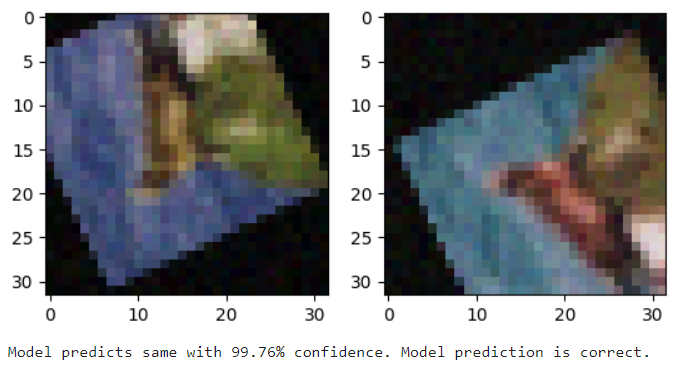

# Image Equivalence Model

A convolutional neural network for determining if two modified images originate from the same source. 

## About the Project

This project is intended to illustrate the process of creating a convolutional neural network for the purpose of computer vision and image processing. To this end, I derived a new dataset from the CIFAR100 dataset, creating image pairs that were modified by various torchvision transforms. Half of the pairs contained images derived from the same source image, and half of the pairs contained images derived from different source images. 

The model created for this project takes an image pair and determines whether the images come from the same source or not.

Below is an example of a pair derived from the same source and the model's evaluation of it:

Next is an example of a pair derived from different sources and the model's evaluation of it:

The model was designed using the PyTorch library and implements a siamese architecture, where both images in each pair are put through the same convolutional block to extract their features. Those features are then combined and put through a fully-connected block to create the model's output.

![A diagram of the model arcitecture. The text "Input 1" and "Input 2" is visible at the top of the image. A line is drawn from each down to a box with the text "Convolutional Block." Two lines come out the other side and meet the text "Feature Map 1" and "Feature Map 2" respectively. The lines then turn inwards and combine at a central point. A line comes down from the meeting point then encounters a box with the text "Fully-connected block." The line emerges on the other side and leads to the text "output."](.github/images/model_diagram.png)

## Downloading the Project

If you wish to download the project, the following steps are required.

### Prereqisites

- Download Anaconda or Miniconda from https://www.anaconda.com.

- Download Git from https://git-scm.com, of course.

### Installation

In the following order:

1. From your command line, clone this GitHub repository with `git clone https://github.com/sbush111/image-equivalence-model.git`

2. Set up the anaconda environment with `conda env create -f environment.yml`

3. Activate the environment with `conda activate image-equivalence-model`

4. Run the script `data_preprocessing/preprocess_data.py` to download the CIFAR dataset and derive the Image Pair dataset from it.

5. Launch Jupyter Notebook with the command `jupyter notebook`. 

From the Jupyter Notebook UI, you can browse and run the various scripts and notebooks in the project. 

## License

This is free and unencumbered software released into the public domain. See UNLICENSE.txt for more information.

## Contact

See https://sean-bush.com for more information.